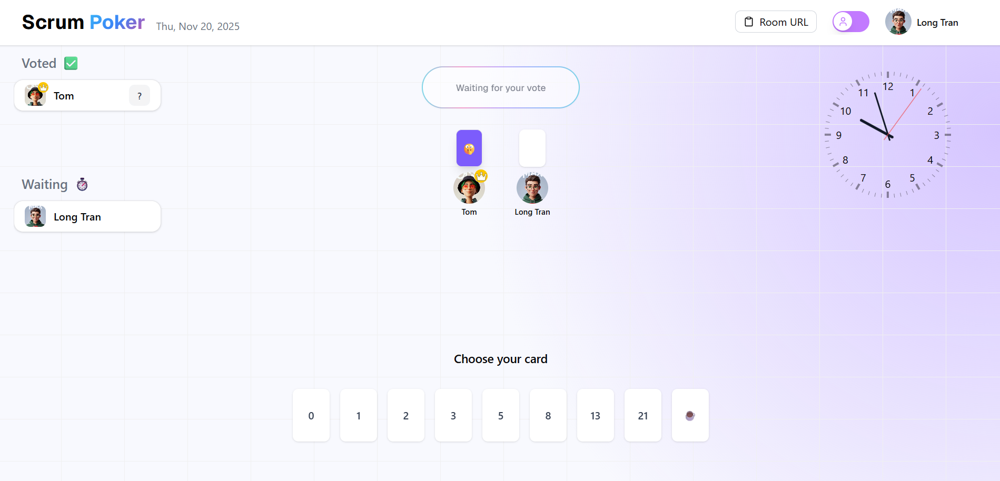

# Planning Poker - Agile Estimation Made Easy

Planning Poker is a real-time, collaborative estimation tool designed for agile teams. It helps teams estimate work items through consensus-based discussions using the Planning Poker technique.


**Demo**: https://plainning-poker-rho.vercel.app/
## 🎮 Key Features

### User Experience
- **Easy Room Creation**: Create a poker room instantly with one click
- **Seamless Join**: Join existing rooms via shareable links
- **Avatar Selection**: Personalize your presence with custom avatars
- **Role Selection**: Choose between voter and observer roles
- **Real-time Updates**: See participants and votes in real-time
- **Beautiful UI**: Clean, modern interface with smooth transitions

### Poker Session Features
- **Vote Management**:
  - Hidden voting until all votes are cast
  - Vote reveal with visual indicators
  - Vote reset for new rounds
- **Participant Management**:
  - Real-time participant list
  - Observer/Voter role switching
  - Admin controls for room management
- **Visualization**:
  - Card-based voting interface
  - Visual statistics for vote distribution
  - Clear consensus indicators

### Technical Implementation
- Built with [Next.js](https://nextjs.org) 13 App Router
- Real-time updates with Firebase Realtime Database
- Modern UI components with TailwindCSS and shadcn/ui
- Responsive design for all devices

## 🚀 Getting Started

1. **Clone & Install**
   ```bash
   git clone https://github.com/LongTranIT/PlainningPoker.git
   cd PlainningPoker
   npm install
   ```

2. **Set up Firebase**
   - Create a Firebase project
   - Enable Realtime Database
   - Enable Anonymous Authentication
   - Add your Firebase config to `.env.local`
   - Deploy security rules using `database.rules.json`

3. **Configure Database Rules**
   ```bash
   # Deploy Firebase Realtime Database rules
   firebase deploy --only database
   ```
   The `database.rules.json` file contains security rules that:
   - Allow anonymous users to create and join rooms
   - Restrict access to room data
   - Enable real-time data synchronization with proper validation

4. **Run the Development Server**
   ```bash
   npm run dev
   ```

5. **Open the App**
   - Visit [http://localhost:3000](http://localhost:3000)
   - Create your first poker room!

## 🌟 Usage Tips

1. **Creating a Room**
   - Enter your name and select an avatar
   - Choose your role (voter/observer)
   - Click "Create Room"

2. **Joining a Room**
   - Use the shared room link
   - Enter your details
   - Click "Join Room"

3. **During Sessions**
   - Wait for all votes before reveal
   - Discuss estimates when revealed
   - Reset votes for new items

## 🛠 Technologies

- **Frontend**: Next.js, React, TailwindCSS
- **Backend**: Firebase Realtime Database
- **State Management**: Zustand
- **UI Components**: shadcn/ui
- **Styling**: TailwindCSS, clsx

## 🤝 Contributing

Contributions are welcome! Feel free to:
- Report bugs
- Suggest new features
- Submit pull requests

## 📄 License

MIT License - feel free to use this project as a template for your own Planning Poker implementation!

---

Built with ❤️ by [Long Tran](https://github.com/LongTranIT)
